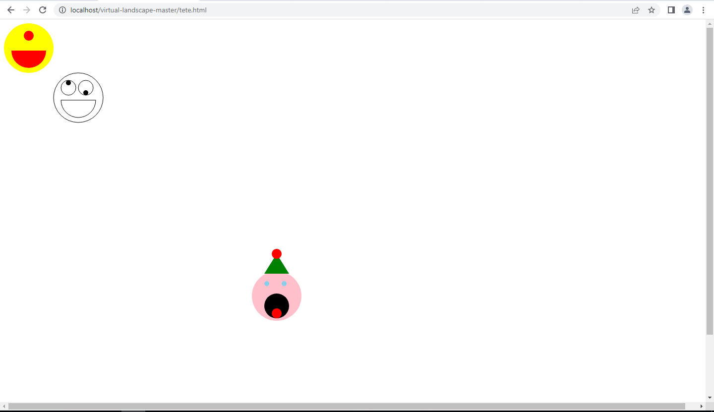
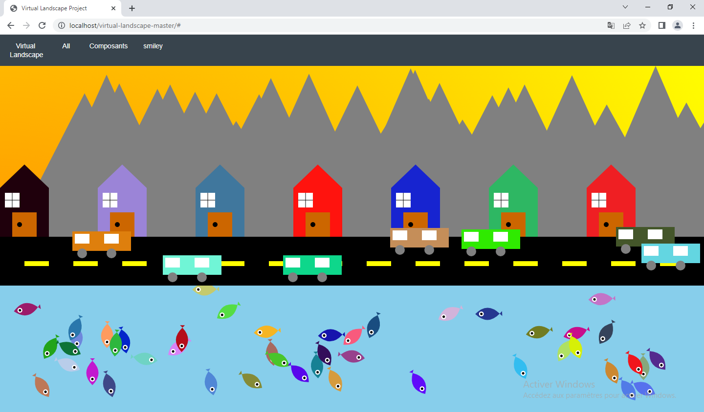
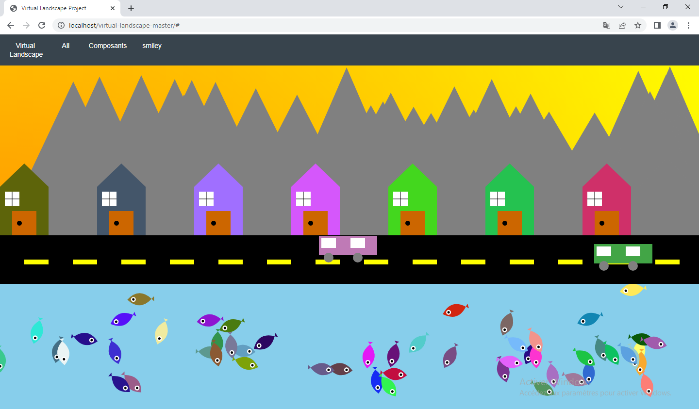
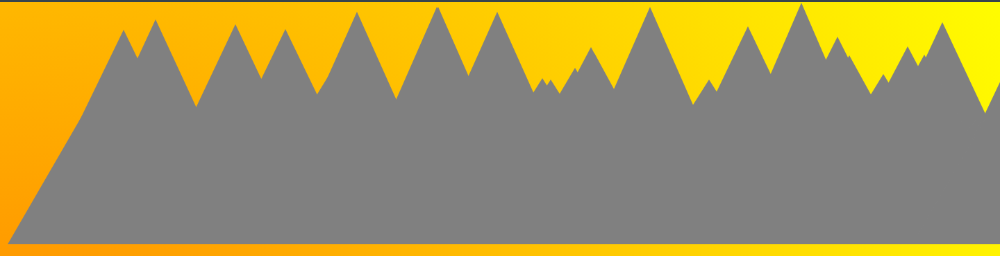
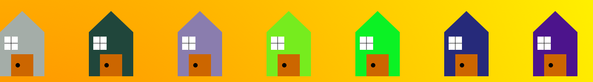
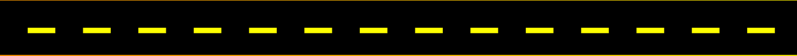
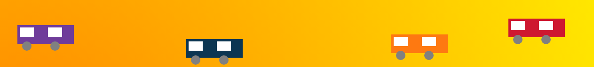
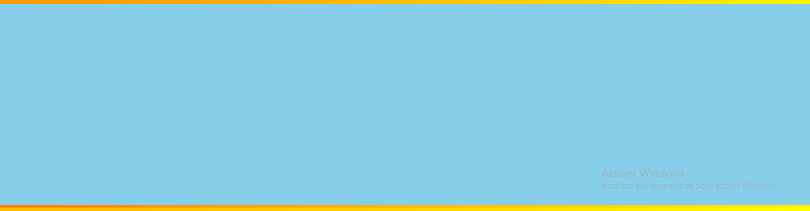
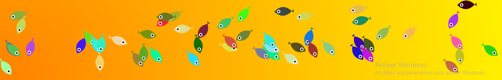
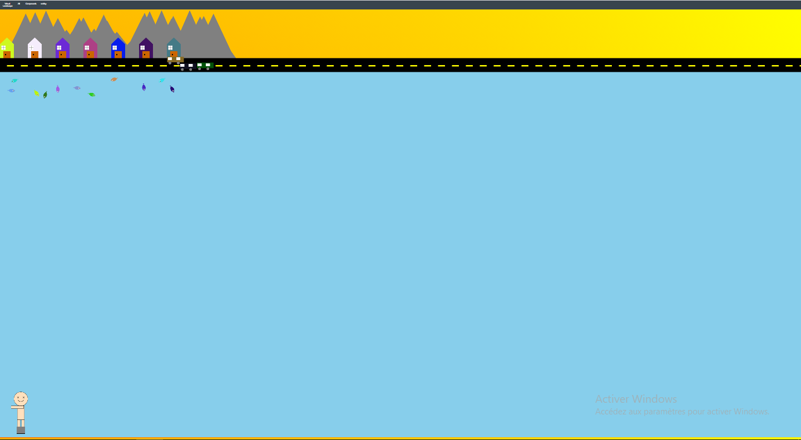

= Compte rendu projet Landscape
:toc:
== Sommaire

Réalisé par : BALCEROWIAK Antoine

Date : Du 20/04/23 au 14/05/2023

== Contexte

Virtual Landscape est notre deuxième projet de
première année en BTS sio. Le but de se projet est
de crée une page internet où s'affiche des dessins qui
on une part d'aléatoire sur le position ou taille
fait en javascript avec canvas.

== Introduction

Tout d'abord avant de commencer le site internet
on devait créé trois smiley différents pour se
familiariser avec javascript

== Le site

Voici le rendu de mon site :

Mon paysage représente une ville vu de loin composé de:

- Montagnes
- Maisons
- une routes
- Voiture
- eau
- poissons

les parties aléatoires de mon site sont :

- Montagnes leurs tailles et le nombres
- Maisons leurs couleurs
- Voiture leurs positions sur la routes le nombres et la couleur
- poissons leurs positions, nombres, l'angle et la couleur

== Le code du site

Pour effectuer le site j'ai coder en html pour la base
du site et javascript pour les dessins et l'aléatoire

[source,javascript]
----
 constructor(
    x = 0,
    y = 0,
    width = 0,
    height = 0,
    fillColor = '',
    strokeColor = '',
    strokeWidth = 2,
    pesanteur = false,
    ordreConstruction = 100
  ) {
    super(x, y, width, height, fillColor, strokeColor, strokeWidth, pesanteur, ordreConstruction)
  }
----
Chaque élément utilise se constructeur comme base
ensuite on peut les modifié pour créé de l'aléatoire
avec notamment
[source,javascript]
----
~~(Math.random()
----
[source,javascript]
----
draw (ctx) {
    ctx.save()
    this.Montagne(ctx,this.x,this.y)
    ctx.restore()
  }
Montagne(ctx,dx,dy) {
    let ox = dx
    let oy = dy
    ctx.beginPath();
    ctx.moveTo(ox+0, 350);
    ctx.lineTo(ox+150,oy+0);
    ctx.lineTo(ox+300, 350);
    ctx.fillStyle = "gray";
    ctx.fill();
}
  static buildForms() {
    let max = Math.floor(Math.random() * 10) + 60;// max in [60..70]
    let forms = []
      for (let i = 0; i < max; i++) {
        forms.push(
          new Montagne(
            ~~(Math.random() * 1400  ),
            Math.floor(Math.random() * 201)
          )
        )
      }
    return forms
  }
}
----
Le code ci-dessus permet de dessiner une Montagne
avec les variables ox qui s'additionne a la position
de base la montagne avec une valeur aléotoire en x allant
jusqu'a 1400 et oy permet de changer sa taille aléatoirement
et max qui permet de choisir le nombre de montagne
de 60 à 70.

Résultat:

[source,javascript]
----
 draw (ctx) {
    ctx.save()
    for (let i = 0; i < 1400; i=i+200) {
      let r = Math.floor(Math.random() * 256)
      let g = Math.floor(Math.random() * 256)
      let b = Math.floor(Math.random() * 256)
      // Dessiner le toit de la maison
      ctx.beginPath();
      ctx.moveTo(i, 250);
      ctx.lineTo(i + 50, 202);
      ctx.lineTo(i + 100, 250);
      ctx.closePath();
      ctx.fillStyle = 'rgb('+r+','+g+','+b+')';
      ctx.fill();
      // Dessiner du carré de la maison
      ctx.fillStyle = 'rgb('+r+','+g+','+b+')';
      ctx.fillRect(i, 250, 100, 100);
      // Dessiner la porte
      ctx.fillStyle = "#cc6600";
      ctx.fillRect(i + 25, 300, 50, 50);
      // Dessiner la fenêtre
      ctx.fillStyle = "white";
      ctx.fillRect(i + 10, 260, 30, 30);
      // Dessiner la croix sur la fenêtre centrée
      ctx.beginPath();
      ctx.moveTo(i + 10, 275);
      ctx.lineTo(i + 40, 275);
      ctx.moveTo(i + 25, 260);
      ctx.lineTo(i + 25, 290);
      ctx.strokeStyle = "black";
      ctx.stroke();
      // Dessiner la poignée de porte
      ctx.beginPath();
      ctx.arc(i + 40, 325, 5, 0, Math.PI * 2);
      ctx.fillStyle = "#000000";
      ctx.fill();
}
----
Voici le code de la maison la partie aléatoire est la couleur
de la maison avec le
[source,javascript]
----
      let r = Math.floor(Math.random() * 256)
      let g = Math.floor(Math.random() * 256)
      let b = Math.floor(Math.random() * 256)
----
qui permet d'avoir un nombre entre 0 et 255
pour rouge bleu et vert afin d'avoir une couleur
aléatoire

Résultat:

[source,javascript]
----
// Dessin de la route
    ctx.fillStyle = 'black';
    ctx.fillRect(0, 350 , 10000, 100);
    for (let i = 0; i < 100; i++) {
      ctx.fillStyle = 'yellow';
      ctx.fillRect(100 * i + 50, 400, 50, 10);
    }
----
Voici le code pour la route et il n'y a pas de partie aléatoire
Résultat:

[source,javascript]
----
Voiture(ctx,dx,dy) {
    let ox = dx
    let oy = dy
    let r = Math.floor(Math.random() * 256)
    let g = Math.floor(Math.random() * 256)
    let b = Math.floor(Math.random() * 256)
    // Dessin de la voiture
    ctx.fillStyle = 'rgb('+r+','+g+','+b+')';
    ctx.fillRect(20 + ox, oy+330, 120, 40);
    ctx.fillStyle = "white";
    ctx.fillRect(25 + ox, oy+335, 30, 20);
    ctx.fillRect(85 + ox, oy+335, 30, 20);
    ctx.beginPath();
    ctx.arc(40 + ox, oy+375, 10, 0, Math.PI*2, true);
    ctx.arc(100 + ox, oy+375, 10, 0, Math.PI*2, true);
    ctx.fillStyle = "gray";
    ctx.fill();
    }
static buildForms() {
    let max = Math.floor(Math.random() * 9) +1// max in [1..10]
    let forms = []
    for (let i = 0; i < max; i++) {
        forms.push(
        new Voiture(
        ~~(Math.random() * 1400  ),
        Math.floor(Math.random() * 60)
----
Voici le code de la voiture qui la couleur aléatoire comme la
maison et ox qui modifie ajoute une valeur jusqu'a 1400
a sa valeur de base et oy qui ajoute jusqu'a 60 pour que sa
position en y soit aléoitoire sur la routes

Résultat:

[source,javascript]
----
ctx.fillStyle = 'skyblue';
ctx.fillRect(0, 350, 10000, 50000);
----
Voici le code de l'eau qui est juste un grand
rectangle bleu
Résutat:

[source,javascript]
----
poisson(ctx,dx,dy) {
    let ox = dx
    let oy = dy
    let r = Math.floor(Math.random() * 256)
    let g = Math.floor(Math.random() * 256)
    let b = Math.floor(Math.random() * 256)
    let angle = Math.floor(Math.random() * 180)

    ctx.beginPath();
    // Effectuer une rotation autour du centre du poisson
    ctx.translate(ox, oy);
    ctx.rotate(angle * Math.PI / 180);
    ctx.translate(-ox, -oy);

    //corps du poisson
    ctx.beginPath();
    ctx.fillStyle = 'rgb('+r+','+g+','+b+')';
    ctx.moveTo(ox+25, oy+50);
    ctx.quadraticCurveTo(ox+50, oy+25, ox+75, oy+50);
    ctx.quadraticCurveTo(ox+50, oy+75, ox+25, oy+50);
    ctx.fill();

    // Dessiner l'œil du poisson
    ctx.beginPath();
    ctx.fillStyle = '#ffffff';
    ctx.arc(ox+62.5, oy+50, 5, 0, 2 * Math.PI);
    ctx.fill();

    ctx.beginPath();
    ctx.fillStyle = '#000000';
    ctx.arc(ox+62.5, oy+50, 2.5, 0, 2 * Math.PI);
    ctx.fill();

    // Dessiner la queue du poisson
    ctx.beginPath();
    ctx.moveTo(ox+25, oy+50);
    ctx.lineTo(ox+20, oy+ 45);
    ctx.lineTo(ox+20, oy+55);
    ctx.fillStyle = 'rgb('+r+','+g+','+b+')';
    ctx.fill();
    ctx.restore();
}
static buildForms() {
    let max = Math.floor(Math.random() * 90) +10// max in [10..100]
    let forms = []
      for (let i = 0; i < max; i++) {
        forms.push(
          new Poisson(
            ~~(Math.random() * 1400  ),
            Math.floor(Math.random() * 100) + 500

----
Voici le code pour le poisson avec la couleur aléatoire
sa position en x qui va jusqu'a 1400 et en y qui va de
500 a 600 pour qu'il soit en dessous de la route et qu'il depasse
pas de l'écran, et le nombre de poisson et entre 10 et 100
et aussi la partie pour modifié l'angle du poisson qui
est :

[source,javascript]
----
    ctx.translate(ox, oy);
    ctx.rotate(angle * Math.PI / 180);
    ctx.translate(-ox, -oy);
----

Résultat:

Bonus :

J'ai rajouté un dessin caché qu'on voit quand on change
l'échelle de la page au minimum en bas a gauche de la page

Voici son code

[source,javascript]
----
draw (ctx) {
    ctx.save()

     // Variables pour la position de l'homme
    var x = 50;
    var y = 2700;

    // Dessiner la tête
    ctx.beginPath();
    ctx.arc(100 + x, 100 + y, 50, 0, 2 * Math.PI);
    ctx.fillStyle = "#ffe0bd";
    ctx.fill();
    ctx.stroke();

    // Dessiner le corps
    ctx.beginPath();
    ctx.rect(75 + x, 150 + y, 50, 100);
    ctx.fillStyle = "#ffe0bd";
    ctx.fill();
    ctx.stroke();

    // Dessiner les bras
    ctx.beginPath();
    ctx.rect(30 + x, 150 + y, 90, 20);
    ctx.fillStyle = "#ffe0bd";
    ctx.fill();
    ctx.stroke();

    // Dessiner les jambes
    ctx.beginPath();
    ctx.rect(75 + x, 250 + y, 20, 100);
    ctx.rect(105 + x, 250 + y, 20, 100);
    ctx.fillStyle = "#ffe0bd";
    ctx.fill();
    ctx.stroke();

    // Dessiner la tête
    ctx.beginPath();
    ctx.arc(100 + x, 100 + y, 50, 0, 2 * Math.PI);
    ctx.fillStyle = "#ffe0bd";
    ctx.fill();
    ctx.stroke();

    // Dessiner les yeux
    ctx.beginPath();
    ctx.moveTo(75 + x, 85 + y);
    ctx.lineTo(85 + x, 95 + y);
    ctx.moveTo(85 + x, 85 + y);
    ctx.lineTo(75 + x, 95 + y);
    ctx.moveTo(115 + x, 85 + y);
    ctx.lineTo(125 + x, 95 + y);
    ctx.moveTo(125 + x, 85 + y);
    ctx.lineTo(115 + x, 95 + y);
    ctx.strokeStyle = "black";
    ctx.stroke();

    // Dessiner la bouche
    ctx.beginPath();
    ctx.moveTo(80 + x, 110 + y);
    ctx.quadraticCurveTo(100 + x, 130 + y, 120 + x, 110 + y);
    ctx.strokeStyle = "black";
    ctx.lineWidth = 2;
    ctx.stroke();

    // Dessiner un rectangle gris en bas des jambes
    ctx.beginPath();
    ctx.rect(70 + x, 350 + y, 60, -50);
    ctx.fillStyle = "grey";
    ctx.fill();
    ctx.stroke();

    ctx.restore()
    }
----

== Conclusion

Le projet virtual Landscape m'a permis d'apprendre à
utiliser javascript et canvas et pour se projet je n'est pas particulièrement
rencontré de problème
